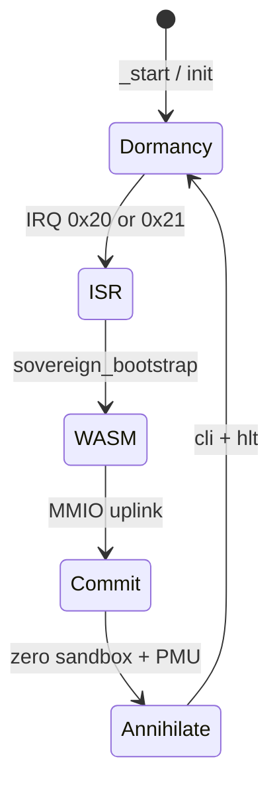

# PROJECT AETHER-ENCLAVE

Atmospheric-State Execution Module — a `#![no_std]` bare-metal unikernel that wakes on hardware interrupt, runs a bounded WebAssembly diagnostic payload via **wasmi**, commits proof to MMIO uplink registers, and returns to zero-power dormancy.

## Repository layout (Cargo workspace-ready)

```text
aether_enclave/
├── .cargo/
│   └── config.toml          # Default target + build-std for bare metal
├── Cargo.toml               # Package manifest (lib + bin)
├── link.x                   # Fixed physical memory layout (x86_64)
├── rust-toolchain.toml      # rust-src + x86_64-unknown-none
├── README.md
└── src/
    ├── lib.rs               # Crate root (#![no_std], module exports)
    ├── main.rs              # `_start`, dormancy loop, panic handler
    ├── interrupts.rs        # IVT / IDT, ISR → sovereign_bootstrap
    ├── memory.rs            # 64 KiB sandbox, bump arena, ISR stack
    ├── mmio.rs              # Sensor + uplink + PMU MMIO map
    ├── runtime.rs           # AetherHost + HostCalls (wasmi)
    ├── shutdown.rs          # Scrub, register clear, HLT
    └── wasm_payload.rs      # AUTO-GENERATED from `payload.wat` by build.rs
├── payload.wat              # Source WAT — edit and rebuild to change guest payload
├── build.rs                 # WAT → WASM → `wasm_payload.rs` injection
```

### Multi-crate workspace (optional expansion)

```text
aether_enclave_workspace/
├── Cargo.toml               # [workspace] members = ["enclave", "payload-gen"]
├── enclave/                 # Move this crate here
│   ├── Cargo.toml
│   └── src/ ...
└── payload-gen/             # Host tool (std) to compile .wat → wasm_payload.rs
    ├── Cargo.toml
    └── src/main.rs
```

Root `Cargo.toml` workspace example:

```toml
[workspace]
resolver = "2"
members = ["enclave", "payload-gen"]
```

## Architecture flow



## Build (x86_64 bare-metal simulation)

Prerequisites:

```bash
rustup toolchain install nightly
rustup component add rust-src --toolchain nightly
rustup target add x86_64-unknown-none
```

Build:

```bash
cargo +nightly build -Z build-std=core,alloc,compiler_builtins -Z build-std-features=compiler-builtins-mem
```

Release (size-optimized):

```bash
cargo +nightly build --release -Z build-std=core,alloc,compiler_builtins -Z build-std-features=compiler-builtins-mem
```

## ARM Cortex-M (flight target sketch)

```bash
rustup target add thumbv7em-none-eabihf
cargo +nightly build --target thumbv7em-none-eabihf \
  -Z build-std=core,alloc,compiler_builtins -Z build-std-features=compiler-builtins-mem
```

Replace `link.x` with your MCU linker script and implement `cortex_m_stub_init` NVIC wiring in `interrupts.rs`.

## Bench IRQ without external hardware

From a debugger or a small harness, call:

```rust
aether_enclave::mmio::sim_inject_o2_drop();
aether_enclave::interrupts::software_trigger(
    aether_enclave::interrupts::HardwareInterrupt::AtmosphericPressureThreshold,
);
```

## Key constants

| Symbol | Value | Role |
|--------|-------|------|
| `SANDBOX_MEMORY_SIZE` | 64 KiB | WASM linear memory cap |
| `ATMOSPHERIC_PRESSURE_THRESHOLD` | vector `0x20` | O₂ density IRQ |
| `KINETIC_JOINT_ACTUATION` | vector `0x21` | Deployment joint IRQ |

## Safety notes

- ISRs execute with `cli` (no nested IRQ) and call directly into `sovereign_bootstrap` (no scheduler).
- All `alloc` traffic uses a bump arena; sandbox pages are zeroed on annihilation.
- Host imports (`aether::read_sensor`, `aether::commit_uplink`) validate guest memory bounds before MMIO access.
